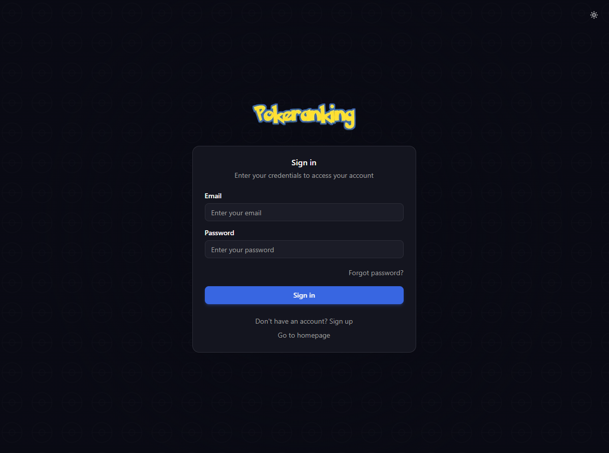
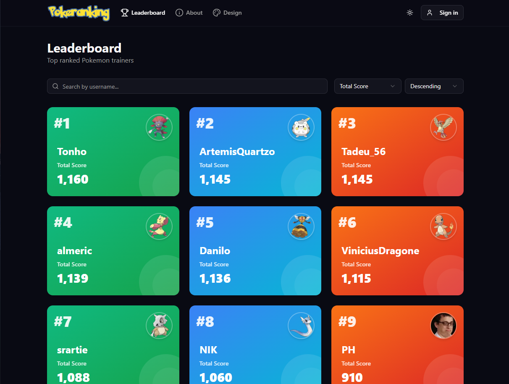

# Pokeranking

If you find this project useful, please consider giving it a ⭐ on GitHub!





## Introduction

Pokeranking is a project that started as a hobby five years ago to help a Brazilian streamer rank his favorite Pokemon while also interacting with his community.

At the time, I implemented the entire application on Next.js using Vercel's serverless API. Five years later, I decided to rebuild it entirely from scratch, applying solid architectural design principles.

Users can create personalized tier lists to rank their favorite Pokemon, organizing them into custom zones (S-tier, A-tier, etc.). When building a ranking, users pick Pokemon from boxes—curated collections that filter the full Pokedex. Everyone starts with a default box containing all Pokemon, but can create custom boxes or browse community-shared ones (e.g., "Gen 1 Only" or "Legendaries").

The platform also features role-based permissions where admins can manage Pokemon by adding the newest ones or editing Pokemon attributes. The Pokemon attributes were originally web-scraped, but they might include errors—which is where the community comes in to help.

### Image Loading Strategy

Loading images was a difficult design choice. I ultimately decided to go with a mixed approach: loading the bulk of images from Next.js's public static serving for already-registered Pokemon, while using Cloudinary storage for new ones. This allows dynamic insertion without redeploying the entire application.

The idea behind this approach is to avoid hitting Cloudinary's free tier limit. Images are also cached on the user's end once loaded for the first time. Periodically, I run a script to move new Pokemon images from Cloudinary to Next.js static serving.

### Migration Plans

After completing this refactor, there will be work to migrate the old users and Pokemon data to the new backend.

### System Requirements & Tech Stack

The system was designed to be scalable while leveraging free-tier services:

- **Storage**: Cloudinary (image hosting)
- **Distributed Cache**: Upstash Redis
- **Database**: MongoDB Atlas
- **Backend**: NestJS deployed as serverless functions on Vercel
- **Email Service**: Resend
- **Frontend**: Next.js with Tailwind CSS and React TanStack Query for query caching

Caching is implemented on both the frontend and backend for faster response times, while being careful not to exceed any quotas.

### Internationalization

There is also a language requirement, so we leverage i18n on both the frontend and backend. The primary user base is Portuguese-speaking, but I wanted the platform to be accessible to everyone.

### Backend Architecture Highlights

The backend was built following NestJS best practices:

- MVC pattern with clear separation of concerns
- DTOs for request and response validation
- Full E2E test coverage with in-memory MongoDB and fixtures
- Rate limiting on sensitive endpoints
- Email-based user activation
- JWT authentication

Caching points were strategically placed on the heaviest queries: fetching all Pokemon and paginated user listings (for default queries only). A generous TTL is used to avoid hitting Upstash's free tier limits while maintaining fast response times.

### Database Operations

The application relies on MongoDB transactions, which is why the Docker Compose setup configures MongoDB with replica set support—a requirement for MongoDB transactions.

### Metrics

There's nothing too fancy here—just a denormalized count of how many Pokemon each user has ranked. I opted for this denormalized approach because there are many reads and few writes, and I didn't want to overload queries with heavy aggregations for counting ranked Pokemon. A simple counter on the user's collection felt sufficient.

---

## Backend

The backend is built with NestJS 11 and follows a modular architecture with clear separation of concerns.

### Tech Stack

| Technology             | Purpose                               |
| ---------------------- | ------------------------------------- |
| NestJS 11              | Backend framework                     |
| MongoDB 7 + Mongoose 8 | Database and ODM                      |
| Upstash Redis          | Distributed caching and rate limiting |
| Passport.js + JWT      | Authentication                        |
| Resend                 | Transactional emails                  |
| nestjs-i18n            | Internationalization                  |
| Swagger/OpenAPI        | API documentation                     |
| Sentry                 | Error tracking and monitoring         |
| Jest + Supertest       | Testing                               |

### Project Structure

```
backend/
├── src/
│   ├── auth/           # Authentication module
│   ├── users/          # User management
│   ├── pokemon/        # Pokemon resources
│   ├── rankings/       # Tier list rankings
│   ├── boxes/          # Pokemon collections
│   ├── email/          # Email service
│   ├── support/        # User feedback and support
│   ├── sentry/         # Error tracking integration
│   ├── common/         # Shared utilities, guards, decorators
│   ├── config/         # Configuration and validation
│   ├── i18n/           # Translation files
│   ├── app.module.ts   # Root module
│   └── main.ts         # Application bootstrap
├── test/               # E2E tests, fixtures, mocks
├── docker-compose.yml  # Local development infrastructure
└── vercel.json         # Deployment configuration
```

### Core Modules

#### Auth Module

Handles user authentication with multiple flows:

- **Login/Register**: Local strategy with email/password
- **Email Verification**: 6-digit code with expiration
- **Password Reset**: Secure token-based flow
- **JWT Authentication**: Bearer token for protected routes
- **Role-Based Access**: Admin and Member roles

#### Users Module

User management and leaderboard:

- Paginated user listing (leaderboard)
- Profile management (self or admin)
- Ranked Pokemon count tracking

#### Pokemon Module

Pokemon resource management (admin-only for mutations):

- CRUD operations for Pokemon
- Image URL validation (Cloudinary domain)

#### Rankings Module

User tier list management:

- Zone-based ranking with custom colors
- Multiple Pokemon per ranking
- Unique titles per user
- Owner-only modifications
- Theme and background customization (see Gamification below)

#### Boxes Module

Pokemon collections with community features:

- Default box per user
- Public/private visibility
- Community favoriting (creates a copy)
- Full-text search on box names

#### Email Module

Transactional emails via Resend:

- Handlebars templating
- Verification emails
- Password reset emails
- Support notification emails

#### Support Module

User feedback and support:

- Message submission endpoint
- Email notifications to support team
- Message validation (10-2000 characters)
- Stores user context with messages

#### Sentry Module

Error tracking integration:

- Global exception capture
- User context tracking
- Environment-aware sampling (10% prod, 100% dev)
- Node profiling for performance monitoring

### Security Features

- **Password Hashing**: bcrypt with secure salt rounds
- **JWT Tokens**: Configurable expiration
- **Rate Limiting**: Sliding window on auth endpoints
- **Email Verification**: Required by default
- **Guards**: Global JWT and role-based guards

### Caching Strategy

Caching is implemented using Upstash Redis:

- **Pokemon List**: Cached with generous TTL
- **User Leaderboard**: Cached for default queries
- **Graceful Degradation**: Non-blocking on Redis errors

### Internationalization

Supported languages:

- English (`en`)
- Portuguese Brazil (`pt-BR`)

Language is resolved via:

- `Accept-Language` header
- Query parameter (`?lang=pt-BR`)

### Database Setup

MongoDB requires replica set configuration for transaction support:

```bash
# Start local infrastructure
cd backend
docker-compose up -d
```

This starts:

- MongoDB 7 with replica set (`rs0`)
- Redis 7 for local caching

### Environment Variables

Required:

```env
NODE_ENV=development
PORT=3000
MONGODB_URI=mongodb://localhost:27018/pokeranking
JWT_SECRET=your-secret-key
RESEND_API_KEY=your-resend-key
RESEND_FROM_EMAIL=noreply@yourdomain.com
UPSTASH_REDIS_URL=your-redis-url
UPSTASH_REDIS_TOKEN=your-redis-token
```

Optional:

```env
JWT_EXPIRATION=1h
EMAIL_VERIFICATION_REQUIRED=true
FRONTEND_URL=http://localhost:3000
ALLOWED_IMAGE_DOMAINS=res.cloudinary.com
RATE_LIMIT_VERIFY_EMAIL=10
RATE_LIMIT_RESEND_EMAIL=2
RATE_LIMIT_WINDOW_SECONDS=60
SENTRY_DSN=your-sentry-dsn
SUPPORT_EMAIL=support@yourdomain.com
```

### Testing

The backend has comprehensive E2E test coverage using:

- **Jest**: Test runner
- **MongoDB Memory Server**: Isolated in-memory database
- **Supertest**: HTTP assertions
- **Mocked Services**: Redis and email services

```bash
# Run unit tests
npm run test

# Run E2E tests
npm run test:e2e

# Run with coverage
npm run test:cov
```

### Development Commands

```bash
# Install dependencies
npm install

# Start development server (watch mode)
npm run dev

# Build for production
npm run build

# Lint code
npm run lint

# Format code
npm run format

# Export OpenAPI spec
npm run export:openapi
```

### API Documentation

Swagger documentation is available in development mode at:

```
http://localhost:3000/api/docs
```

The OpenAPI spec is exported to `packages/api-client/openapi.json` for client generation using Orval.

### Deployment

The backend is configured for Vercel serverless deployment via `vercel.json`. Swagger is disabled in production for security.

---

## Frontend

The frontend is built with Next.js 16 using the App Router and follows a feature-based architecture.

### Tech Stack

| Technology            | Purpose                         |
| --------------------- | ------------------------------- |
| Next.js 16            | React framework with App Router |
| React 19              | UI library                      |
| TailwindCSS 4         | Utility-first styling           |
| NextAuth              | Authentication (JWT sessions)   |
| TanStack Query        | Data fetching and caching       |
| i18next               | Internationalization            |
| Radix UI + shadcn/ui  | Accessible component library    |
| Zod + react-hook-form | Form validation and handling    |
| Stripe                | Payment processing (donations)  |
| Google Analytics      | Event tracking and analytics    |

### Project Structure

```
frontend/
├── src/
│   ├── app/              # Next.js App Router pages
│   │   ├── (auth)/       # Auth pages (signin, signup, verify-email, etc.)
│   │   ├── my-rankings/  # Ranking management pages
│   │   ├── contribute/   # Donation and contribution pages
│   │   ├── support/      # Support and feedback page
│   │   ├── design/       # Design system showcase
│   │   └── api/          # API routes (NextAuth)
│   ├── components/       # Shared components (ui/, navbar, logo)
│   ├── features/         # Feature modules (users/, pokemon/, rankings/)
│   ├── hooks/            # Custom hooks (auth, forms, analytics)
│   ├── i18n/             # i18n configuration
│   ├── lib/              # Utilities (auth, config, routes, stripe)
│   ├── providers/        # React context providers
│   └── middleware.ts     # Next.js middleware (auth protection)
└── public/               # Static assets
```

### Core Features

#### Authentication

Full authentication flow integrated with the backend:

- Sign in / Sign up with email verification
- Password reset flow
- Protected routes via middleware
- Session management with NextAuth

#### User Features

- Leaderboard with pagination and filters
- User cards with ranking stats

#### Pokemon Features

- Pokemon cards with type icons
- Type-based styling

#### Ranking Features

- Create and edit personalized tier lists
- Theme and background customization
- Live preview while editing

#### Gamification - Theme System

Rankings feature a 4-tier unlock progression system that rewards users for ranking more Pokemon:

| Tier         | Unlock Requirement         | Themes                      |
| ------------ | -------------------------- | --------------------------- |
| Starter      | Always available           | Classic, Fire, Water, Grass |
| Intermediate | 10 Pokemon or 5% of total  | Electric, Psychic, Poison   |
| Advanced     | 25 Pokemon or 15% of total | Dragon, Ghost, Dark         |
| Premium      | 50 Pokemon or 30% of total | Sunset, Ocean, Legendary    |

- Independent background customization from card theme
- Visual lock indicators with progress bars
- Tooltips showing unlock requirements

#### Contribution System

- GitHub stars integration for community support
- Stripe embedded checkout for donations
- Success page with email confirmation

#### Analytics

Google Analytics 4 integration with custom event tracking:

- `ranking_view` / `ranking_create` / `ranking_edit` - Ranking interactions
- `ranking_share` - Share tracking with method
- `pokemon_search` - Search term tracking
- `tier_change` - Pokemon tier changes
- `donation_start` / `donation_complete` - Donation funnel

### Environment Variables

Required:

```env
NEXT_PUBLIC_API_URL=http://localhost:8000
NEXTAUTH_SECRET=your-secret-key
NEXTAUTH_URL=http://localhost:3000
```

Optional:

```env
NEXT_PUBLIC_GA_MEASUREMENT_ID=G-XXXXXXXXXX
NEXT_PUBLIC_STRIPE_PUBLISHABLE_KEY=pk_test_xxx
NEXT_PUBLIC_STRIPE_PRICE_ID=price_xxx
STRIPE_SECRET_KEY=sk_test_xxx
NEXT_PUBLIC_GITHUB_URL=https://github.com/your-repo
```

### Development Commands

```bash
# Install dependencies
npm install

# Start development server
npm run dev

# Build for production
npm run build

# Lint code
npm run lint
```

### API Integration

The frontend uses the `@pokeranking/api-client` package for type-safe API calls. This package is auto-generated from the backend's OpenAPI spec using Orval, providing TanStack Query hooks for data fetching.
